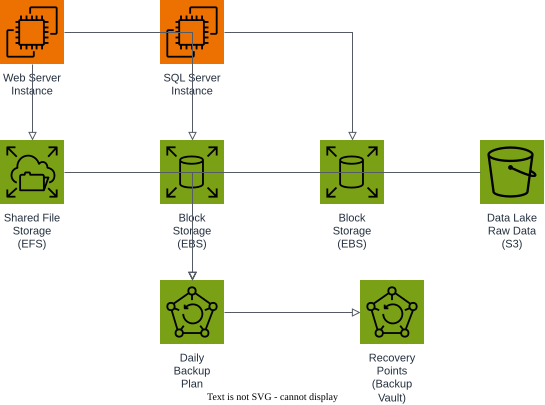

# AWS Project: Managed Backup Solution

Centralized, policy-driven backup with Floci and Terraform:

1. a web server and a SQL server instance run the workloads;
2. their data lives in shared file storage (EFS), dedicated block storage (EBS), and a data lake raw bucket (S3);
3. AWS Backup applies one plan and schedule across all of them;
4. recovery points land in a single backup vault, ready to restore.

## Prerequisites

- Docker
- Terraform 1.5+
- AWS CLI

## Start Floci

```bash
docker compose up -d
```

## Apply Terraform

```bash
terraform init
terraform apply
```

## Architecture



A web server instance and a SQL server instance write to shared file storage (EFS), block storage (EBS), and a data lake raw bucket (S3); a single AWS Backup plan covers all of them and writes recovery points to one backup vault.

The diagram source is a real, editable [draw.io](https://www.drawio.com/) file at [docs/architecture.drawio](docs/architecture.drawio), generated programmatically with the [drawpyo](https://github.com/MerrimanInd/drawpyo) Python library. Open the `.drawio` file directly on GitHub or with the draw.io desktop app / [app.diagrams.net](https://app.diagrams.net/) to edit it.

To regenerate the diagram (`.drawio` source + the `.svg`/`.png` embedded above) after changing the architecture:

```bash
python3 -m venv .diagram-venv
.diagram-venv/bin/pip install drawpyo
.diagram-venv/bin/python scripts/generate_diagram.py

# rasterize the .drawio file to svg/png (used by the README) via headless draw.io
docker run --rm -v "$PWD/docs":/data -w /data rlespinasse/drawio-export -f svg -o . --output-mode relative --remove-page-suffix .
docker run --rm -v "$PWD/docs":/data -w /data rlespinasse/drawio-export -f png -o . --output-mode relative --remove-page-suffix -t .
```

## Test the backup plan

Check that the plan, vault, and selection were created:

```bash
export ENDPOINT=http://localhost:4566

aws --endpoint-url "$ENDPOINT" backup list-backup-plans
aws --endpoint-url "$ENDPOINT" backup list-backup-vaults
aws --endpoint-url "$ENDPOINT" backup list-backup-selections \
  --backup-plan-id "$(terraform output -raw backup_plan_id)"
```

Trigger an on-demand backup job for the data lake bucket and follow it:

```bash
JOB_ID=$(aws --endpoint-url "$ENDPOINT" backup start-backup-job \
  --backup-vault-name "$(terraform output -raw backup_vault_name)" \
  --resource-arn "$(terraform output -raw data_lake_bucket_name | xargs -I{} echo arn:aws:s3:::{})" \
  --iam-role-arn "$(aws --endpoint-url "$ENDPOINT" iam get-role --role-name floci-backup-backup-role --query 'Role.Arn' --output text)" \
  --query 'BackupJobId' --output text)

aws --endpoint-url "$ENDPOINT" backup describe-backup-job --backup-job-id "$JOB_ID"
```

If you want to follow the execution, watch the Floci container logs:

```bash
docker compose logs -f floci
```

## Clean up

```bash
terraform destroy
docker compose down
```
